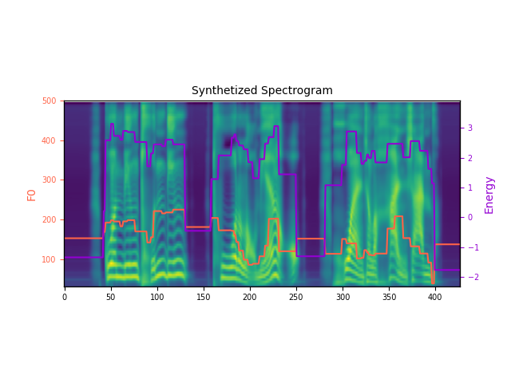

## Abstract

Expressive human speech generally abounds with rich and flexible speech prosody variations. The speech prosody predictors in existing expressive speech synthesis methods mostly produce deterministic predictions, which are learned by directly minimizing the norm of prosody prediction error. Its unimodal nature leads to a mismatch with ground truth distribution and harms the model's ability in making diverse predictions. Thus, we propose a novel prosody predictor based on the denoising diffusion probabilistic model to take advantage of its high-quality generative modeling and training stability. Experiment results confirm that the proposed prosody predictor outperforms the deterministic baseline on both the expressiveness and diversity of prediction results even with fewer network parameters.

## Proposed prosody predictor & expressive TTS system

The proposed prosody predictor is a denoising diffusion probabilistic model (DDPM) on 3-dimensional data $x_0$, which consists of phoneme-wise fundamental frequencely (F0), energy, and duration (frame numbers), respectively.

As shown in Fig.1, we incorporate the proposed DDPM-based prosody predictor with a pre-trained TTS backbone based on FastSpeech2 (FS2) to construct an expressive TTS system, where the phoneme-wise F0, energy and duration features are utilized as the prosody representation.

    
     
    
 Fig.1: Proposed expressive TTS system architecture. 

## Evaluation

We apply the proposed method to a private Mandarin audiobook dataset with 28.23 hours of speech audio.
We also train the original prosody predictors in FS2 with mean squared error (MSE) as the deterministic **baseline** model for comparison, which contains 60.5% more network parameters than the proposed prosody predictor.

### Expressiveness

| Script | Proposed | Baseline | FS2 with Ground Truth Prosody | Ground Truth Audio (Reconstructed) |
|:------------|:------------:|:------------:|:------------:|:------------:|
|乱飞的火团儿腾在了空中,又变成了黑色的蝴蝶儿,妖冶地飘飘四散。|<audio controls><source src='./static/expressiveness/proposed/a19f3d78af.wav' type='audio/wav'>Your browser does not support the audio element.</audio>|<audio controls><source src='./static/expressiveness/baseline/a19f3d78af.wav' type='audio/wav'>Your browser does not support the audio element.</audio>|<audio controls><source src='./static/expressiveness/gtprosody/a19f3d78af.wav' type='audio/wav'>Your browser does not support the audio element.</audio>|<audio controls><source src='./static/expressiveness/gt/a19f3d78af.wav'>Your browser does not support the audio element.</audio>|
|以往看到如此情景,是诗情画意的。今天,则是揪着心地疼啊:|<audio controls><source src='./static/expressiveness/proposed/c0c868090e.wav' type='audio/wav'>Your browser does not support the audio element.</audio>|<audio controls><source src='./static/expressiveness/baseline/c0c868090e.wav' type='audio/wav'>Your browser does not support the audio element.</audio>|<audio controls><source src='./static/expressiveness/gtprosody/c0c868090e.wav' type='audio/wav'>Your browser does not support the audio element.</audio>|<audio controls><source src='./static/expressiveness/gt/c0c868090e.wav'>Your browser does not support the audio element.</audio>|
|汪半城夹起一只螃蟹,勾起了当年闯关东差点儿让螃蟹撑破了肚皮的事儿,便说给大家听。|<audio controls><source src='./static/expressiveness/proposed/dfcf904e7f.wav' type='audio/wav'>Your browser does not support the audio element.</audio>|<audio controls><source src='./static/expressiveness/baseline/dfcf904e7f.wav' type='audio/wav'>Your browser does not support the audio element.</audio>|<audio controls><source src='./static/expressiveness/gtprosody/dfcf904e7f.wav' type='audio/wav'>Your browser does not support the audio element.</audio>|<audio controls><source src='./static/expressiveness/gt/dfcf904e7f.wav'>Your browser does not support the audio element.</audio>|
|前年,调署承德知县,本来是顺风顺水,不想却丢了官差。|<audio controls><source src='./static/expressiveness/proposed/cd6ccfd866.wav' type='audio/wav'>Your browser does not support the audio element.</audio>|<audio controls><source src='./static/expressiveness/baseline/cd6ccfd866.wav' type='audio/wav'>Your browser does not support the audio element.</audio>|<audio controls><source src='./static/expressiveness/gtprosody/cd6ccfd866.wav' type='audio/wav'>Your browser does not support the audio element.</audio>|<audio controls><source src='./static/expressiveness/gt/cd6ccfd866.wav'>Your browser does not support the audio element.</audio>|
|小死老婆儿,儿子才当个县案首,就把你得瑟得没老没少的啊,想把你爹气死咋的?|<audio controls><source src='./static/expressiveness/proposed/f6053a59fa.wav' type='audio/wav'>Your browser does not support the audio element.</audio>|<audio controls><source src='./static/expressiveness/baseline/f6053a59fa.wav' type='audio/wav'>Your browser does not support the audio element.</audio>|<audio controls><source src='./static/expressiveness/gtprosody/f6053a59fa.wav' type='audio/wav'>Your browser does not support the audio element.</audio>|<audio controls><source src='./static/expressiveness/gt/f6053a59fa.wav'>Your browser does not support the audio element.</audio>|
|我咋气他了?啊我咋气他了他外孙子当了县案首,报个喜儿咋还气着他了呢?|<audio controls><source src='./static/expressiveness/proposed/208c4574e5.wav' type='audio/wav'>Your browser does not support the audio element.</audio>|<audio controls><source src='./static/expressiveness/baseline/208c4574e5.wav' type='audio/wav'>Your browser does not support the audio element.</audio>|<audio controls><source src='./static/expressiveness/gtprosody/208c4574e5.wav' type='audio/wav'>Your browser does not support the audio element.</audio>|<audio controls><source src='./static/expressiveness/gt/208c4574e5.wav'>Your browser does not support the audio element.</audio>|
|哼,一家儿去了四个,连一个秀才的毛儿都没摸着,还大夫第呢,丢不丢人?|<audio controls><source src='./static/expressiveness/proposed/e808d9c3ad.wav' type='audio/wav'>Your browser does not support the audio element.</audio>|<audio controls><source src='./static/expressiveness/baseline/e808d9c3ad.wav' type='audio/wav'>Your browser does not support the audio element.</audio>|<audio controls><source src='./static/expressiveness/gtprosody/e808d9c3ad.wav' type='audio/wav'>Your browser does not support the audio element.</audio>|<audio controls><source src='./static/expressiveness/gt/e808d9c3ad.wav'>Your browser does not support the audio element.</audio>|
|啊,我咋不知道呐?他砦四海敢背着我干这缺德的事儿,看我回去怎么收拾他!|<audio controls><source src='./static/expressiveness/proposed/f69dceec1c.wav' type='audio/wav'>Your browser does not support the audio element.</audio>|<audio controls><source src='./static/expressiveness/baseline/f69dceec1c.wav' type='audio/wav'>Your browser does not support the audio element.</audio>|<audio controls><source src='./static/expressiveness/gtprosody/f69dceec1c.wav' type='audio/wav'>Your browser does not support the audio element.</audio>|<audio controls><source src='./static/expressiveness/gt/f69dceec1c.wav'>Your browser does not support the audio element.</audio>|

### Diversity

| Script |  |  |  |
|:------------|:-------:|:-------:|:-------:|
|瞧着遭大罪吧!富老将军人是不错.|<audio controls><source src='./static/diversity/0-2fab06c563.wav' type='audio/wav'>Your browser does not support the audio element.</audio> |<audio controls><source src='./static/expressiveness/1-2fab06c563.wav' type='audio/wav'>Your browser does not support the audio element.</audio> |<audio controls><source src='./static/expressiveness/2-2fab06c563.wav' type='audio/wav'>Your browser does not support the audio element.</audio> |
|平均开五垧荒,累折裤衩带儿也完不成啊!”|<audio controls><source src='./static/diversity/0-e8b20acfc6.wav' type='audio/wav'>Your browser does not support the audio element.</audio> |<audio controls><source src='./static/expressiveness/1-e8b20acfc6.wav' type='audio/wav'>Your browser does not support the audio element.</audio> |<audio controls><source src='./static/expressiveness/2-e8b20acfc6.wav' type='audio/wav'>Your browser does not support the audio element.</audio> |
|官兵屯丁脱了老棉袄,换上了汗衫子。|<audio controls><source src='./static/diversity/0-2cf1cb87fa.wav' type='audio/wav'>Your browser does not support the audio element.</audio> |<audio controls><source src='./static/expressiveness/1-2cf1cb87fa.wav' type='audio/wav'>Your browser does not support the audio element.</audio> |<audio controls><source src='./static/expressiveness/2-2cf1cb87fa.wav' type='audio/wav'>Your browser does not support the audio element.</audio> |
|南风吹到了胸脯子上,像相好儿姑娘的小手儿在抚摩,|<audio controls><source src='./static/diversity/0-5109dd3cb6.wav' type='audio/wav'>Your browser does not support the audio element.</audio> |<audio controls><source src='./static/expressiveness/1-5109dd3cb6.wav' type='audio/wav'>Your browser does not support the audio element.</audio> |<audio controls><source src='./static/expressiveness/2-5109dd3cb6.wav' type='audio/wav'>Your browser does not support the audio element.</audio> |
|不小心被火舌舔着了翅膀儿的,一头扎进了火海。|<audio controls><source src='./static/diversity/0-e6da4bad44.wav' type='audio/wav'>Your browser does not support the audio element.</audio> |<audio controls><source src='./static/expressiveness/1-e6da4bad44.wav' type='audio/wav'>Your browser does not support the audio element.</audio> |<audio controls><source src='./static/expressiveness/2-e6da4bad44.wav' type='audio/wav'>Your browser does not support the audio element.</audio> |
